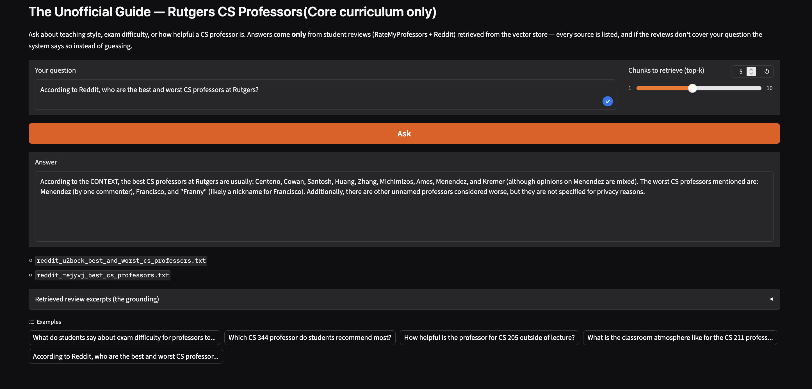
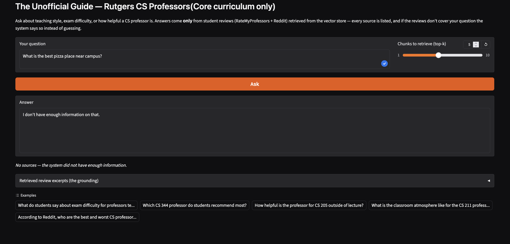

# The Unofficial Guide — Project 1

> **How to use this template:**
> Complete each section *after* you've built and tested the corresponding part of your system.
> Do not write placeholder text — if a section isn't done yet, leave it blank and come back.
> Every section below is required for submission. One-liners will not receive full credit.

---

## Domain

<!-- What topic or category of knowledge does your system cover?
     Why is this knowledge valuable, and why is it hard to find through official channels?
     Example: "Student reviews of CS professors at [university] — useful because official
     course descriptions don't reflect teaching style, exam difficulty, or workload." -->

Student reviews of CS professors at Rutgers University(NB) teach the CS core curriculum: I realized that just having student reviews of cs professors was too broad for me and I had too much information that did not work with the scope of this projects or were outdated. As such, I decided to shorten it to mainly the teachers teaching core classes at my university. The sources I have are about 10 cs professor reviews from RMP and 2 reddit posts on cs professors. These show the professor's teaching style, behavior, class difficulty, and more.

---

## Document Sources

<!-- List every source you collected documents from.
     Be specific: include URLs, subreddit names, forum thread titles, or file names.
     Aim for variety — sources that together cover different subtopics or perspectives. -->

| # | Source | Description | URL or location |
|---|--------|-------------|-----------------|
| 1 | RMP| Reviews of a professor teaching cs 111 and cs 112, and some electives| https://www.ratemyprofessors.com/professor/600296|
| 2 | RMP| Reviews of a professor teaching cs 205, cs 344, and cs 211, and some electives| https://www.ratemyprofessors.com/professor/2066022|
| 3 | RMP| Reviews of a professor teaching cs 205, 206, and some electives| https://www.ratemyprofessors.com/professor/2519830|
| 4 | RMP| Reviews of a professor teaching cs 111 and cs 112| https://www.ratemyprofessors.com/professor/2875899|
| 5 | RMP| Reviews of professor teaching cs 344 and cs 513| https://www.ratemyprofessors.com/professor/2447976|
| 6 | RMP| Reviews of a professor teaching cs 344 and some electives| https://www.ratemyprofessors.com/professor/2366659|
| 7 | RMP| Reviews of a professor teaching cs 211 and some electives| https://www.ratemyprofessors.com/professor/1916642|
| 8 | RMP| Reviews of a professor teaching cs 211| https://www.ratemyprofessors.com/professor/2635012|
| 9 | RMP| Reviews of a professor teaching cs 344| https://www.ratemyprofessors.com/professor/3060894|
| 10 | RMP| Reviews of a professor teaching cs 205, 206, 11 and more| https://www.ratemyprofessors.com/professor/2297066|
| 11 | Reddit| General reddit post of some good an bad professors in cs department. 4 years old.| https://www.reddit.com/r/rutgers/comments/u2bock/best_cs_professors_and_worst_cs_professors/|
| 12 | Reddit| General reddit post of some good professors in cs department. 4 years old.|https://www.reddit.com/r/rutgers/comments/tejyvj/best_cs_professors/ |

---

## How to Run the App

### Prerequisites
- Python 3.10+
- A free [Groq API key](https://console.groq.com) (no credit card required)

### 1. Set up the environment

```bash
# Create and activate a virtual environment
python -m venv .venv
source .venv/bin/activate        # on Windows: .venv\Scripts\activate

# Install dependencies
pip install -r requirements.txt
```

### 2. Add your API key

```bash
# Copy the example file and add your Groq key
cp .env.example .env
# then edit .env and set GROQ_API_KEY=your_actual_key
```

### 3. Build the data pipeline

Run these once, in order, to ingest the documents, chunk them, and embed them into ChromaDB:

```bash
python ingest_rmp.py   # fetches RMP reviews → one .txt per professor in documents/
python chunk.py        # splits documents/ into review-aware chunks → chunks.json
python embed.py        # embeds chunks into a persistent ChromaDB collection (chroma_db/)
```

> The `documents/` folder and `chroma_db/` are already populated in this repo, so you can skip straight to step 4 if you don't need to rebuild from scratch.

### 4. Launch the app

```bash
python app.py
```

This starts the Gradio interface. Open the local URL printed in the terminal (typically http://127.0.0.1:7860) and ask questions about the CS professors.

---

## Chunking Strategy

<!-- Describe your chunking approach with enough specificity that someone else could reproduce it.
     Include:
     - Chunk size (characters or tokens) and why that size fits your documents
     - Overlap size and why (or why not) you used overlap
     - Any preprocessing you did before chunking (e.g., stripping HTML, removing headers)
     - What your final chunk count was across all documents -->

**Chunk size:** 600-character cap. I made Chunking review-aware: Each document is split on its `[` block markers (`[Professor ...]`, `[Reddit comment ...]`, `[Original post]`) so every review becomes equivalent to one chunk, and only a block exceeding 600 chars falls back to a sliding-window character split.

**Overlap:** 50 characters, applied only in the rare fallback case where a single review runs past the 600-char cap.

**Why these choices fit your documents:** My documented data is mainly short, self-containted student reviews from ratemyprofessor and reddit. As such, it was possible for me to fit each review into a chunk generally speaking, making ingestion and chuncking relatively simple. The rmp reviews were processed during ingestion to reverse-engineer the GraphQL layout to gain the information neded but in block format with professor, course, rating, reviews. I originally planned a 400-character fixed-size window, but after ingestion I measured the real review-length distribution: median 446 characters, max ~550(Got the data from claude doing the analysis).As such, I raised the cap to 600 so every review stays one intact, attributed chunk.

**Final chunk count:** 893 chunks across the 12 documents (min 72 / max 550 / avg 400 chars).

**Sample chunks:** 

{
    "id": "reddit_u2bock_best_and_worst_cs_professors.txt::chunk-12",
    "source": "reddit_u2bock_best_and_worst_cs_professors.txt",
    "chunk_index": 12,
    "text": "[Reddit comment | thread: Best and worst CS professors | score: 3]\nMy favorite post here is Cowan roasting wrong answers on Chegg at the height of Covid cheating. He's simply the best."
},
{
    "id": "rmp_2066022_surya_teja_gavva.txt::chunk-19",
    "source": "rmp_2066022_surya_teja_gavva.txt",
    "chunk_index": 19,
    "text": "[Professor Surya Teja Gavva | Course: CS205 | Quality: 5/5 | Difficulty: 2/5 | Grade: A | Would take again: Yes | 2025-12-22]\nExcellent class with a caring professor, very effective and organized lectures. The lean proofs and crypto games were fun.\nTags: Amazing lectures"
  },
{
    "id": "rmp_2297066_wesley_cowan.txt::chunk-98",
    "source": "rmp_2297066_wesley_cowan.txt",
    "chunk_index": 98,
    "text": "[Professor Wesley Cowan | Course: CS205 | Quality: 5/5 | Difficulty: 3/5 | Grade: Not sure yet | Would take again: Yes | 2020-05-10]\nThe man is a legend.\nTags: Respected, Amazing lectures, Caring"
  },
{
    "id": "rmp_2366659_yongfeng_zhang.txt::chunk-4",
    "source": "rmp_2366659_yongfeng_zhang.txt",
    "chunk_index": 4,
    "text": "[Professor Yongfeng Zhang | Course: CS344 | Quality: 5/5 | Difficulty: 2/5 | Grade: A | Would take again: Yes | 2025-11-18]\nProfessor Zhang is one of the best computer science professors at Rutgers. He is so patient with explaining things, and he can make even the most difficult concepts intuitive. If you have the chance, would highly recommend taking a class with him.\nTags: EXTRA CREDIT, Amazing lectures , Caring"
  },
{
    "id": "rmp_2519830_samaneh_hamidi.txt::chunk-125",
    "source": "rmp_2519830_samaneh_hamidi.txt",
    "chunk_index": 125,
    "text": "[Professor Samaneh Hamidi | Course: DIS206 | Quality: 1/5 | Difficulty: 5/5 | Grade: C | 2024-10-30]\nShe doesn't give clear learning material, at least for me, as she doesn't give any homework, and a lot of the stuff you just have to self-learn from the textbook, and the quiz and exams are tough for no reason. IDK I just failed my midterm so I'm here to rant.\nTags: Tough grader, Beware of pop quizzes, So many papers"
  },

---

## Embedding Model

<!-- Name the embedding model you used and explain your choice.
     Then answer: if you were deploying this system for real users and cost wasn't a constraint,
     what tradeoffs would you weigh in choosing a different model?
     Consider: context length limits, multilingual support, accuracy on domain-specific text,
     latency, and local vs. API-hosted. -->

**Model used:** `all-MiniLM-L6-v2` via sentence-transformers, chosen because it runs locally with no API key or cost and is fast enough to re-embed the whole document loads in seconds. The vectors are normalized and stored in a persistent ChromaDB collection using cosine distance.

**Production tradeoff reflection:** If cost weren't a constraint I'd move to a larger API-hosted model (e.g. OpenAI's text-embedding-3-large), accepting the added latency and per-call cost in exchange for better accuracy on the informal, slang-heavy language of student reviews and a longer context window for the occasional long review.

---

## Grounded Generation

<!-- Explain how your system enforces grounding — how does it prevent the LLM from answering
     beyond the retrieved documents?
     Describe both your system prompt (what instruction you gave the model) and any structural
     choices (e.g., how you formatted the context, whether you filtered low-relevance chunks).
     Do not just say "I told it to use the documents" — show the actual instruction or explain
     the mechanism. -->

**System prompt grounding instruction:** The system prompt gives five absolute rules:

1. Answer ONLY from the provided CONTEXT block
2. Never use outside/prior knowledge
3. Never invent names/courses/ratings
4. Every claim must be supported by a CONTEXT sentence
5. if the context is insufficient reply with the exact refusal sentence "I don't have enough information on that." 
     
I reinforced these rules by `temperature=0`, and to stop calling the LLM when cosine distance goes beyond 0.85 so that off domain questions dont waste the model's power 
     
**How source attribution is surfaced in the response:** Sources are built manually from the metadata of the chunks actually fed to the model (`build_sources`), and as such are never parsed from the model's reply, making a citation unable to be hallucinated or omitted.

---

## Evaluation Report

<!-- Run your 5 test questions from planning.md through your system and record the results.
     Be honest — a partially accurate or inaccurate result that you explain well is more
     valuable than a suspiciously perfect result. -->

| # | Question | Expected answer | System retrieved response | Retrieval quality | Response accuracy |
|---|----------|-----------------|------------------------------|-------------------|-------------------|
| 1 | What do students say about exam difficulty for professors teaching CS 111? | Reviews describing how hard CS 111 exams are | I don't have enough information on that. | Partially relevant | Partially accurate |
| 2 | Which CS 344 professor do students recommend most? | The CS 344 professor rated most positively | According to the CONTEXT, Bernstein is the recommended professor for CS 344. | Relevant at k>5 / Off-target at k=5* | Accurate |
| 3 | How helpful is the professor for CS 205 outside of lecture? | Out-of-lecture availability of a CS 205 professor | According to review [4], Professor Wesley Cowan, who teaches CS205, "is super in depth and interesting and hes an overall great guy" and "Really understanding and just wants to make sure you learned during class." However, it does not specifically mention how helpful he is outside of lecture. Another review of Professor Cowan for a different course, CS440, in [2] mentions that he is "Accessible outside class", but this may not apply to CS205. Therefore, I don't have enough information on that. | Partially relevant | Partially accurate |
| 4 | What is the classroom atmosphere like for the CS 211 professors? | Teaching style/atmosphere of CS 211 professors | For CS 211, Menendez's teaching is reported to be poor, but his projects are straightforward. Yipeng Huang's lectures are very detailed, but can be boring if you do not participate in them. | Relevant | Accurate |
| 5 | According to Reddit, who are the best and worst CS professors at Rutgers? | Reddit threads naming good/bad CS professors | According to the CONTEXT, the best CS professors at Rutgers are usually: Centeno, Cowan, Santosh, Huang, Zhang, Michimizos, Ames, Menendez, and Kremer (although opinions on Menendez are mixed). The worst CS professors mentioned are: Menendez (by one commenter), Francisco, and "Franny" (likely a nickname for Francisco). Additionally, there are other unnamed professors considered worse, but they are not specified for privacy reasons. | Relevant | Accurate |

**Retrieval quality:** Relevant / Partially relevant / Off-target  
**Response accuracy:** Accurate / Partially accurate / Inaccurate


### Chunk-relevance breakdown

<!-- For each question, the actual top-k=5 chunks returned by `python retrieval.py`,
     with cosine distance and a one-line judgment of why each chunk is (or isn't)
     relevant. This is what drives the one-word retrieval-quality verdict above.
     Distance: 0.0 = identical, ~1.0 = unrelated; lower = more relevant. -->

**Q1 — CS 111 exam difficulty → Partially relevant.** Only 1 of the 5 retrieved chunks is actually a CS 111 review:

| Rank | Distance | Source / chunk | Relevant? |
|------|----------|----------------|-----------|
| 1 | 0.289 | Huang `CS211` c4 | ✗ right topic (exam weighting) but wrong course (211) |
| 2 | 0.331 | Centeno `CS111112` c2 | ✓ the *only* genuine CS 111 chunk, and it discusses exam difficulty |
| 3 | 0.346 | Huang `CS211` c6 | ✗ wrong course (211) |
| 4 | 0.349 | Hamidi `CS206` c7 | ✗ wrong course (206) |
| 5 | 0.375 | Hamidi `CS206` c14 | ✗ wrong course (206) |

The single on-target chunk ranks #2 instead of #1 because RMP stores the course as the concatenated string `CS111112`, so "CS 111" embeds weakly against it — the exact ingestion/retrieval mismatch documented in the Failure Case Analysis below.

**Q2 — Most-recommended CS 344 professor → Off-target (verdict revised).** At k=5, **zero** CS 344 chunks are retrieved — all five are CS 112/111/205 "best professor" reviews:

| Rank | Distance | Source / chunk | Relevant? |
|------|----------|----------------|-----------|
| 1 | 0.263 | Centeno `CS112` c30 | ✗ "best CS professor" language matched, wrong course |
| 2 | 0.277 | Reddit *Best CS professors* c5 | ~ lists profs by course incl. one CS 344 mention |
| 3 | 0.315 | Centeno `CS111` c55 | ✗ wrong course |
| 4 | 0.316 | Cowan `CS205` c90 | ✗ wrong course |
| 5 | 0.322 | Reddit *Best CS professors* c2 | ✗ intro/data-structures profs, wrong course |

The recorded answer ("Bernstein") is **not** supported by the top-5 — it comes from `rmp_2447976_aaron_bernstein.txt` (a real CS 344 source) that only surfaces when `k` is raised above 5 via the Gradio slider. The query embedding latches onto generic "recommend / best professor" phrasing rather than the course number, so at the default k=5 retrieval misses the relevant document entirely.

**Q3 — CS 205 out-of-lecture help → Partially relevant.** Only 1 of 5 chunks is the right course, and it doesn't address office hours:

| Rank | Distance | Source / chunk | Relevant? |
|------|----------|----------------|-----------|
| 1 | 0.322 | Hamidi `CS206` c267 | ✗ wrong course |
| 2 | 0.348 | Cowan `CS440` c69 | ~ same professor (Cowan), wrong course; mentions accessibility |
| 3 | 0.354 | Gavva `CS344` c78 | ✗ wrong course; "accommodating" matched |
| 4 | 0.355 | Cowan `CS205` c90 | ✓ right course, but only praises lectures — silent on out-of-lecture |
| 5 | 0.362 | Huang `CS211` c29 | ✗ wrong course |

Retrieval surfaces the right professor (Cowan) and a chunk hinting at accessibility (#2), but the one true CS 205 chunk says nothing about out-of-lecture help — so the model correctly hedged to "I don't have enough information."

**Q4 — CS 211 classroom atmosphere → Relevant.** 2 of 5 chunks directly cover CS 211, plus supporting Reddit context:

| Rank | Distance | Source / chunk | Relevant? |
|------|----------|----------------|-----------|
| 1 | 0.338 | Reddit *Best CS professors* c2 | ~ intro/data-structures atmosphere, names Centeno |
| 2 | 0.378 | Reddit *Best CS professors* c5 | ~ per-course prof rundown |
| 3 | 0.390 | Huang `CS211` c13 | ✓ CS 211, describes class structure/atmosphere |
| 4 | 0.401 | Hamidi `CS205` c108 | ✗ wrong course |
| 5 | 0.410 | Reddit *Best CS professors* c3 | ✓ "Huang teaches 211… awesome prof" |

The Menendez detail in the recorded answer comes from beyond the top-5 (higher k) — at k=5 the supported CS 211 claims center on Huang.

**Q5 — Reddit best/worst professors → Relevant.** All 5 chunks are from the two Reddit threads at very low distances (0.16–0.27), the tightest retrieval of any question:

| Rank | Distance | Source / chunk | Relevant? |
|------|----------|----------------|-----------|
| 1 | 0.160 | Reddit *Best and worst* c9 | ✓ directly names good professors (Centeno, Cowan, Huang, Zhang…) |
| 2 | 0.209 | Reddit *Best CS professors* c0 | ~ thread header/URL only — low signal, but short text scores low distance |
| 3 | 0.213 | Reddit *Best and worst* c0 | ~ thread header/URL only |
| 4 | 0.235 | Reddit *Best and worst* c3 | ✓ discusses worst professors ("Franny", unnamed grad-level profs) |
| 5 | 0.267 | Reddit *Best and worst* c13 | ✓ names liked professors (Centeno, Menéndez, Cowan, Kremer) |

The two header chunks (#2, #3) are near-empty source/URL lines that rank well only because short text yields a low cosine distance — a minor chunking artifact that wastes 2 of the 5 slots but doesn't hurt the answer since the substantive chunks (#1, #4, #5) carry the names.

---

## Failure Case Analysis

<!-- Identify at least one question where retrieval or generation did not work as expected.
     Write a specific explanation of *why* it failed, tied to a part of the pipeline.

     "The answer was wrong" is not an explanation.

     "The relevant information was split across a chunk boundary, so retrieval returned
     only half the context — the model didn't have enough to answer correctly" is an explanation.

     "The embedding model treated the professor's nickname as out-of-vocabulary and returned
     results from an unrelated review" is an explanation. -->

**Question that failed:** "What do students say about exam difficulty for professors teaching CS 111?"

**What the system returned:** The refusal sentence "I don't have enough information on that," even though CS 111 reviews exist in the corpus.

**Root cause (tied to a specific pipeline stage):** I learned this is an ingestion + retrieval mismatch. RMP stores the course as a concatenated string (`CS111112`) rather than `CS 111`, so the query "CS 111" embeds poorly against the actual CS 111 review chunks — retrieval instead returned low-distance (~0.29–0.37) chunks from CS 211 and CS 206, which passed the relevance backstop but didn't address CS 111 exams, so the grounded model correctly refused rather than answering from unrelated reviews.

**What you would change to fix it:** The most straightforward fix is to split 'CS111CS112' into their respective courses and apply filters. But I have also realized increasing the chunks used gives a better answer. 

---

## Spec Reflection

<!-- Reflect on how planning.md shaped your implementation.
     Answer both questions with at least 2–3 sentences each. -->

**One way the spec helped you during implementation:** Writing the Chunking Strategy and Retrieval Approach sections up front gave me concrete numbers (chunk cap, overlap, top-k=5, cosine similarity) to hand directly to the AI tools, so the generated `chunk.py` and `embed.py` matched my intended design instead of needing rework.

**One way your implementation diverged from the spec, and why:** The plan specified a 400-character fixed-size window and Claude (Anthropic API) for generation, but I ended up switching to a 600-char review-aware chunker after measuring real review lengths (so reviews stay intact) and to Groq's free llama-3.3-70b for generation to avoid API cost.

---

## AI Usage

<!-- Describe at least 2 specific instances where you used an AI tool during this project.
     For each: what did you give the AI as input, what did it produce, and what did you
     change, override, or direct differently?

     "I used Claude to help me code" is not sufficient.
     "I gave Claude my Chunking Strategy section from planning.md and asked it to implement
     chunk_text(). It returned a function using a fixed character split. I overrode the
     chunk size from 500 to 200 because my documents are short reviews, not long guides." -->

**Instance 1**

- *What I gave the AI:* My Domain and Chunking Strategy sections plus the requirement that RMP reviews load from a GraphQL API, asking it to build the ingestion + chunking code.
- *What it produced:* `ingest_rmp.py` (hitting the RMP GraphQL endpoint and writing one .txt per professor) and a `chunk_text()` using a fixed-size character window.
- *What I changed or overrode:* I had it measure the actual review-length distribution first, then replaced the fixed window with a review-aware splitter and raised the cap from 400 to 600 chars so individual reviews stay intact as one attributable chunk.

**Instance 2**

- *What I gave the AI:* My Architecture and Evaluation Plan sections and asked it to wire retrieved chunks into a grounded-generation step with strong anti-hallucination guarantees.
- *What it produced:* `generate.py` with a strict system prompt and `app.py` Gradio interface feeding top-k chunks to the LLM.
- *What I changed or overrode:* I added a relevance-cutoff backstop (refuse without calling the LLM when all chunks exceed 0.85 distance) and made source attribution programmatic from chunk metadata rather than parsed from the model's reply, and switched the model from the Anthropic API to Groq's free tier.



NOTE: Source attribution is not part of the text itself, but is rather in bullet points right under the textbox, giving the exact document the answer was sourced from. 


Here in this example, I have asked the off domain question, "What is the best pizza place near campus?" The RAG system instantly returns "I don't have enough information on that" because it could not find the respective source. More specifically, the question is still embedded and searched against ChromaDB, but every retrieved chunk exceeds the 0.85 cosine-distance RELEVANCE_CUTOFF, so the relevance filter returns an empty list and the backstop emits the refusal before groq is ever called — making the refusal both instant and immune to the model answering from prior knowledge.